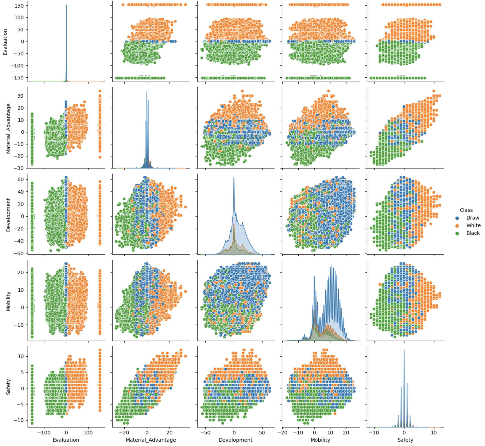
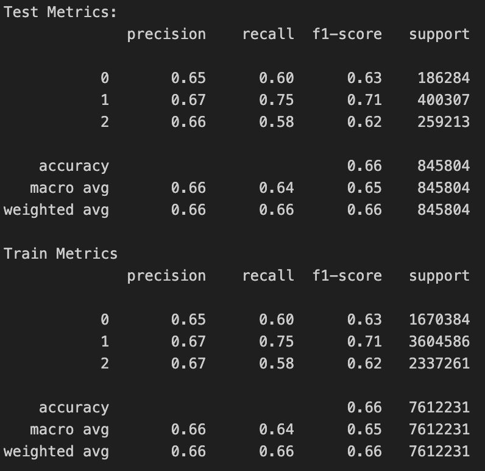

# CSE151A-Group-Project
Ethan Huang \
Noah Danan \
[Juypter Notebook](Group_Project.ipynb)
## Introduction
Chess is a popular game that uses strategic thinking and tactical prowess, played for centuries and still counting. This dataset that we will be using comprises approximately 16 million unique chess positions, each evaluated by the Stockfish chess engine at a depth of 22. Stockfish, a state-of-the-art chess analysis tool, provides precise and detailed evaluations of positions, making this dataset highly valuable for research in artificial intelligence, game theory, and machine learning. The extensive depth of 22 ensures a deep and thorough analysis of each position, offering insights into optimal moves and strategies. This dataset can be instrumental in training advanced machine learning models, developing new chess algorithms, and conducting comprehensive studies on chess strategy and position evaluation.
## Data Exploration
### Since our dataset's only independent variable, an FEN[^1] string, does not work well as either a continuous value or categorical variable, we will be extracting information from it.

The two main features we will be extracting from the chess position are **material advantage** (continuous value) and **development of the pieces** (can be scored into a continuous value). These two attributes will be the data we will use for our modeling as the independent variable to predict the Evaluation Score that has been provided by Stockfish. As a subset of the **development of pieces** features, we will also include the features: **Mobility** and **Safety** to possibly help our Neural Network classify the positions better. They are also heuristics that many chess engines and programmers use for evaluation positions, so it is safe to say that they should at least not hold back the training of the Neural Network.

---
- Material Advantage is a comparison between the pieces that each player holds. Pawns are worth 1, bishops and knights are worth 3, rooks are worth 5, and the Queen is worth 9. While having the matieral advantage is not a consistent indicator if a position is winning, most casual players find this metric reassuring and helpful. The material advantage is in the range of [-39, 39] and can be normalized into a smaller scale, such as [-1, 1]. 

- Development of pieces will be scored using our own evaluation function (the criteria for scoring can be read [below](#development-of-pieces)) and weighted on a 0-100 scale (where positive is white and negative is black like material advantage). This also can be normalized to a [-1,1] scale.

- Mobility is calculated as the difference between how many spaces each color's pieces can go to (not including spaces the opposing pawns control). We use difference to show that positive numbers means White pieces have greater mobility overall and vice versa for Black.

- Safety is calculated as the difference between how many of each color's pieces are defended, where positive number means there are more White pieces that are defended and vice versa for Black.

- The Evaluation score by Stockfish is a bit tricky. Firstly, it is measured in centipawns, so 100 = 1 pawn. Secondly, due to the version of Stockfish that was used to collect this data, which is 11 compared to the present time at 16, we may see abnormally large evaluation scores (greater than 3900) which would greatly affect the scale and putting the distribution at a very difficult to predict area and there may be large discrepancies between our evaluation of development and this Stockfish evaluation. Lastly, the Evaluation data includes forced mate notation, which provides a number moves necessary to achieve checkmate rather than a number to evaluate the position.

- We can use our data to create a classification problem, where we create an Artificial Neural Network that predicts whether a given chess position is winning for white or black, or is at a more drawn position (Our ground truth for this is [explained](#classifying-evaluation) below). This will be a more general version of how current chess evaluators work and will mainly use the indepedent variables that we extracted from the FEN string: material advantage and development.

## Data Preprocessing
We found that normalizing our independent variables did not serve to have much improvement for processing the data in both models. We also held concern that we may lose information due to normalizing since we do not have a clear absolute minimum and absolute maximum. As for the Evaluation values (dependent variable), due to forced checkmates not having any real assigned values, we believe that encoding them to $\pm15320$ (the max/min before normalizing) would serve as an indicator that they are above any other position while also not setting the value too high to skew the datapoints (our max and min for non-forced checkmates are 15319 and -15312 respectively). This way we will know which data points are the forced checkmate positions if they were to be plotted. We also converted the centipawn values to normal evaluation pawn values (divide by 100) so that it is easier to interpret the data without having abnormally large numbers.  
*\* Update after attempting Linear Regression*  
We will now extract an additional feature from our dataset, which will be used for classification. We will classify positions by whether they are winning for either player or estimated to be a draw, which gives us a total of 3 classes. We will be using one hot encoding so we can predict these classes using our 'material_advantage' and 'development' features with a neural network.

## Classifying Evaluation
We will separate the evaluations into 3 classes: White (is winning), Black (is winning), and Draw. Typically speaking, an evaluation of $\pm{2.0}$ is considered a great enough advantage to be converted into a win as long as the player places accurately. Therefore, we will consider 200 centipawns as the threshold for winning.

## Development of Pieces
#### The following function will check how well "developed" a player's core pieces are. There are many factors[^2] to this attribute, so our evaluation would certainly not be the most accurate. We also have our own arbitrary weights for evaluating as we cannot be completely sure how much "better developed" a piece is in relation to other types of pieces. The criteria that we will keep in mind for our evaluation function are the following.
- Queen
  - Penalty for early game development (first 5 moves) (0%, 5% if early game)
  - **Queen mobility** (15%, 20% if not early game)
- Pawn
  - ~~Pawn structure~~ (Difficult and computationally expensive to evaluate)
  - **Pawn Center** (d4 or e4) (10%, 5% if late game)
  - Penalty for "d" and "e" pawns being blocked at their starting squares, but no penalty if other pawns can go to the center instead (10%, 5% if late game)
  - Late game (25+ moves): Penalty for pawns that are still near start position (0%, 10% if late game)
- Knight
  - **Knight mobility** (15%)
  - Penalty if undefended (15%)
  - No weight if at start position
- Bishop
  - **Bishop mobility** (15%)
  - Bishop pair is considered marginally stronger than Bishop Knight and Knight Knight (5%)
  - ~~Color Weakness (missing a bishop and poor pawn structure)~~ (See Pawn)
  - Penalty if undefended (10%)
  - Quarter weight if at start position

> **Mobility omits squares controlled by enemy pawns**

## Pairplot of Features
  
\* Note that the line of data points that are at the max and min of the graphs (pertaining to graphs where Evaluation is involved) are the respective forced checkmates belonging to either White (max) or Black (min)
  
We have created a pairplot to look at how the different features we've extracted from the FEN string correlate to each other, and most importantly, how they correlate to our ground truth variable: Evaluation. In order to help visualize our data, we've also color-coded the data points to differentiate the ones that represent a position where White is winning, Black is winning, or if the position is basically drawn. From what we are able to sumrise, many of the features show very weak correlations with each other with only the correlation between 'material advantage' and 'safety' being significantly strong. This truly shows how difficult it is to properly evaluate chess positions as many heuristics that strong chess engines and their programmers use that have been included here still cannot find a significantly strong correlation with each other or toward the ground truth provided. Nonetheless, we will continue to try to create a model that can have some degree of accuracy at predicting positional advantage.

## Linear Regression, First Model
#### Ground Truth & Prediction
Our ground truth in our data was garnered from Stock Fish 11 evaluations, which was the most advanced chess evaluation system at the time of the dataset's conception, and much stronger than any human player. Due to the features being weakly correlated with each other, we predict that the model was yield a decently high MSE, but that could also be because our dependent variable, Evaluation, has a large range of values.
#### Training the Model
We started by splitting our data into an 90:10 ratio, 90 percent training with 10 percent testing. Then we ran our linear regression on the model, but only for our two main features: material advantage and development. We then do 10-fold cross validation in order to validate our linear regression while also ensuring the same train-test split.  
Here is an example of one iteration of our cross validation:

#### Conclusion
After viewing the graphical data and MSE, we have concluded that not only the linear regression model is not ideal, but trying to minimize MSE for this type of problem is very unlikely to work due to erractic placements of our datapoints. We also found it difficult to fully utilize linear regression modeling with our independent variables since getting different linear functions does not really help much with the goal of predicting position evaluations.  
Instead of using MSE as our scoring function, we plan to reform the data and change the problem into a classification problem to get better results. For this new problem, we believe a Neural Network or SVM would be best to use.

## Modeling Questions
Where does your model fit in the fitting graph? 
Because we are using linear regression for our first model, when looking at our fitting graph, the model would fit towards the beginning of the graph. This is because we are using a simple model and there is a higher chance of error.  
What are the next models you are thinking of and why? 
Next, we are thinking of doing a neural network for our model because it will likely be most compatible with the data and our data is erratic so in order to better fit with the data, it will be good to have multiple activation functions.

## Artifical Neural Network, Second Model
#### Ground Truth & Prediction
Similarly to the ground truth of our [Linear Regression Model](#linear-regression-first-model), we used the Evaluation data from our dataset and converted them to fit into one of three classes: White, Black, Draw ([details](#classifying-evaluation) above). We predict that the Neural Network will yield more tangible results due to simplifying our dependent variable into a classification of only 3 classes, however due to how weakly correlated all our features are with each other and with the Evaluation, our model may not have outstanding accuracy and would be prone to misclassifying.

#### Training the Model
We used the Keras Sequential modeling for our Neural Network and had 7 Dense hidden layers with varying number of units (ranging from 64 to 512 due to the large number of datapoints our dataset contained) and all using the *RELU* activation function. Our output layer uses the *softmax* activation function due to this being a multi-classification problem. We ran the fit with a batch size of 8 and 5 epochs, which we felt was a good tradeoff between training speed while maintaing some degree of accuracy. In our original run with the dataset, we noticed that the Neural Network seemed to incorrectly classify many datapoints as "Draws" (though it still does now, it is not nearly as bad) and came to the conclusion that it may be because there were over twice as many "Draw"s than both "White" and "Black" combined, so we decided to randomly remove 4 million "Draw" datapoints to make the distribution of datapoints between classes to be closer to even. 
 
Here is the resulting Confusion Matrix and Classification Report of the model with a 90:10 train-test split:

#### Conclusion
As we can see from the classification report and confusion matrix, our model was not very accurate at predicting the positional advantages of chess positions given the features we were able to extract from the FEN string. However, we do feel that this was the best the model can do given that there weren't really any strong correlations between any of the features, including the dependent variable. We believe that this only further proves how difficult it is to judge chess positions and that even to this day, Chess is still an NP-Hard problem that has many chess engines and programmers that are still continuing to develop heuristics and algorithms to improve their gameplay. 

[^1]: https://www.wikiwand.com/en/Forsyth%E2%80%93Edwards_Notation
[^2]: https://www.chessprogramming.org/Evaluation_of_Pieces