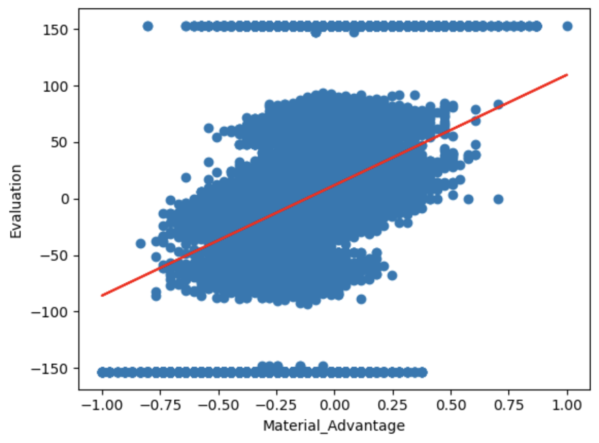

Ethan Huang  
Noah Danan
# Written Report
## Introduction
Chess is a popular game that uses strategic thinking and tactical prowess, played for centuries and still counting. This dataset that we will be using comprises approximately 16 million unique chess positions, each evaluated by the Stockfish chess engine at a depth of 22. Stockfish, a state-of-the-art chess analysis tool, provides precise and detailed evaluations of positions, making this dataset highly valuable for research in artificial intelligence, game theory, and machine learning.   
We chose this subject mostly because both of us are very familiar with the game of Chess and enjoy playing it. We also know of the inhuman capabilities of Chess bots and how they far surpass the skills of even the best grandmasters. With the advancements in AI we have seen bots like Stockfish achieve a Chess rating of 3600. To put this in perspective, the best Chess player possibly of all time, Magnus Carlsen, has peaked at around 2800 Chess rating. Our project aims to emulate just one facet of Stockfish’s ability, being the evaluation of Chess positions. It is important to improve our predictive model as much as possible, as our model can be used to help new Chess players to understand positions and see which side is winning based on the current position.

## Methods
### Data Exploration
After loading the chess data evaluation we noticed one particular issue: Our independent variable was an FEN[^1] String that represents the chessboard and its piece placements. So what we first did was use the given position from the FEN string and extracted features from it that we could at least numerically represent. The features we decided to build from the given FEN strings are the following:
- **Material Advantage**: A comparison between the pieces that each player holds. Pawns are worth 1, bishops and knights are worth 3, rooks are worth 5, and the Queen is worth 9. While having the material advantage is not a consistent indicator that a position is winning, most casual players find this metric reassuring and helpful.
- **Development of Pieces**: An important heuristic for the early to mid games of chess. Developed pieces refer to pieces that are more "active" such that they control more squares near the center and can help with creating an offensive.
- **Mobility**: An important heuristic for every stage of the game and also taken as a subset from calculating the *Development of Pieces* feature. Ensuring your pieces have place to escape while simultaneously having places to attack is paramount to creating a successful strategy in chess.
- **Safety**: A less important but still useful heuristic that is also derived from the calculation of *Development of Pieces* feature. This feature checks if your pieces are not threatened or at least properly defended if so.

## Data Preprocessing
We found that normalizing our independent variables did not serve to have much improvement for processing the data in both models. We also held concern that we may lose information due to normalizing since we do not have a clear absolute minimum and absolute maximum. As for the Evaluation values (dependent variable), due to forced checkmates not having any real assigned values, we believe that encoding them to $\pm15320$ (the max/min before normalizing) would serve as an indicator that they are above any other position while also not setting the value too high to skew the datapoints (our max and min for non-forced checkmates are 15319 and -15312 respectively). This way we will know which data points are the forced checkmate positions if they were to be plotted. We also converted the centipawn values to normal evaluation pawn values (divide by 100) so that it is easier to interpret the data without having abnormally large numbers.  

From what we are able to surmise, many of the features show very weak correlations with each other with only the correlation between 'material advantage' and 'safety' being significantly strong. This truly shows how difficult it is to properly evaluate chess positions as many heuristics that strong chess engines and their programmers use that have been included here still cannot find a significantly strong correlation with each other or toward the ground truth provided.  

After realizing Linear Regression was not going to produce the results we wanted, we decided to change our problem to a multi-classification problem. We classified positions by whether they were winning for either player or estimated to be a draw, which gives us a total of 3 classes. Typically speaking, an evaluation of $\pm{2.0}$ is considered a great enough advantage to be converted into a win as long as the player places accurately. Therefore, we will consider 200 centipawns as the threshold to consider White or Black to be winning and evaluations with less than that threshold would be considered drawn. When using these classifications as numerical data that can be used for our neural network, we will use one-hot encoding to represent each of these 3 classes. 

For the purposes of the Neural Network, we also decided to prune a large portion of the dataset of "Draw" datapoints as there were over twice as many of them compared to the other two classes combined, which may have caused the Neural Network to classify Draws more despite what the features actually tell it, simply because it would achieve a higher accuracy that way.

### Model 1: Linear Regression
We started by splitting our data into an 90:10 ratio, 90 percent training with 10 percent testing. Then we ran our linear regression on the model, but only for our two main features: material advantage and development. We then did 10-fold cross-validation in order to validate our linear regression while also ensuring the same train-test split.

### Model 2: Artificial Neural Network
We used the Keras Sequential modeling for our Neural Network, which has 7 Dense hidden layers with varying number of units (ranging from 64 to 512 due to the large number of datapoints our dataset contained), all using the *RELU* activation function. Our output layer uses the *softmax* activation function due to this being a multi-classification problem. We ran the fit with a batch size of 8 and 5 epochs, which we felt was a good tradeoff between training speed while maintaing some degree of accuracy.  

Our first run of the Neural Network consisted of a 90:10 train-test split. We noticed that the Neural Network seemed to incorrectly classify many datapoints as "Draws" (though it still does now, it is not nearly as bad) and came to the conclusion that it may be because there were over twice as many "Draw"s than both "White" and "Black" combined, so we decided to randomly remove 4 million "Draw" datapoints to make the distribution of datapoints between classes to be closer to even. When doing validation, we did a 5-fold cross-validation, which resulted in an 80:20 train-test split with our pruned dataset.

## Results
### Linear Regression

10-Fold Cross-Validation Statistics: 
Material Advantage
- Test Data MSE Avergage: ~373.25
- Train Data MSE Average: ~373.25
  
Development
- Test Data MSE Avergage: ~408.97
- Train Data MSE Average: ~408.97

## Neural Network

Classification Performance (Training Data):
- Black: Precision - 0.65, recall - 0.60, F1-Score - 0.63
- Draw: Precision - 0.67, recall - 0.75, F1-Score - 0.71
- White: Precision - 0.67, recall - 0.58, F1-Score - 0.62
- Accuracy: 0.66
  
Classification Performance (Test Data):
- Black: Precision - 0.65, recall - 0.61, F1-Score - 0.63
- Draw: Precision - 0.67, recall - 0.75, F1-Score - 0.71
- White: Precision - 0.66, recall - 0.58, F1-Score - 0.62
- Accuracy: 0.66

## Discussion
### Data Exploration
Our initial analysis aimed to gain insight into the structure of our dataset and identify any points of concern. Given that the only "data" we had was an FEN string paired with an Evaluation, we knew that we would need to create a few features ourselves in order to have any agency in creating a predictive model.
Since there are already well-known heuristics in chess, we decided to create our own algorithms to apply these heuristics and use them as our features. The fact of the matter is, however, we are not completely aware how to implement some of these heuristics, which is why we created our own set of rules while using an outside source[^2] as reference to calculate these features. More information about how we calculate the features can be found in our [README](README.md) under **Development of Pieces** or our [Project Notebook](Group_Project.ipynb) under **Functions for Features**.

### Preprocessing
We initially did want to normalize our variables to fit a [-1, 1] scale, but soon realized that a lot of information would be lost in the process. Firstly, the MSE would be incredibly small despite how poor our data should be doing for Linear Regression. Secondly, normalizing Evaluation would make it difficult to judge what values would correspond to a side being in a strong position or if it is closer to a draw. As a byproduct, this would affect all the other features in a similar way.Therefore, the only preprocessing we needed to do reducing the units of the Evaluation variable from centipawns to pawns, which is how most humans would interpret chess position evaluations. We also one-hot encoded the data by Evaluation to make it suitable for the Neural Network model as it would now be able to classify them by "White", "Black", and "Draw". Lastly we had to modify the data so that there was a balance between black, white, and draw, since the model previously would just predict draw every time with around a 0.74 accuracy.

### Model 1 - Linear Regression
We chose a linear regression model to serve as a solid baseline model for future comparison with other models as well as understanding our features better.
Using MSE, we could determine how well the model predicted the evaluation scores.
Given the stable MSE values across all the folds, we can conclude that the model was stable in its predictions.
Given the relatively high MSE from the linear regression model, we were able to determine that this model was not a good fit for the data, as it likely was not able to capture the non-linear patterns in our data. This is what led us to change our model to a DNN.
### Model 2 - Artificial Neural Network
We chose to use a DNN in order to handle the complexity of the chess data, especially any non-linear relationships present.
The training results produced a reasonable accuracy and MSE indicating that the DNN was more effective in dealing with the complexity as opposed to linear regression.
When looking at the various folds, we find that the results are consistent, leading us to believe that the model's predictions are stable.
There was room for improvement with the accuracy, which is likely related to our evaluation functions not being able to fully encapsulate the complexity of the chess positions as well as Stockfish. We also could have done hyperparameter tuning and longer training times, although with the current version the training time was around 12.5 hours.

## Conclusion
### Feature Engineering
We believe that we could have added a more exhaustive list of features, such as king safety, although these would have proven to be extremely complex to implement in code. We could try to fully implement as many features as there are to match the numerous complex principles and heuristics involved in chess. This would allow us to come closer to the level of depth achievable for the Stockfish engine.
### Hyperparameter Tuning
We could have implemented hyperparameter tuning if we had a lot more time, but with the ever-increasing training time with our data, it would’ve been hard to fit it into our model. Although our default hyperparameters were set to reasonable values, going forward we could use either random search or grid search in order to optimize the hyperparameters to try and achieve better results.
### Stockfish Version
Our chess data was evaluated by Stockfish’s version 11 which is somewhat outdated. Stockfish is currently on version 16.1 which would yield more accurate evaluation results. This is something to consider, although not a necessary change, as Stockfish’s version 11 is already well above even the greatest grandmaster chess players. If we did improve our model to come closer to version 11 of Stockfish it would be best to garner data from the more recent iterations of Stockfish in order to update and optimize our own model.

## Statement of Collaboration
Ethan Huang - Project Leader: Main Coder, Handled GitHub, Wrote README, Written Report Editor  
Noah Danan - Project Member: Written Report Drafter, Support Coder, Executed Code with PC

[^1]: https://www.wikiwand.com/en/Forsyth%E2%80%93Edwards_Notation
[^2]: https://www.chessprogramming.org/Evaluation_of_Pieces
